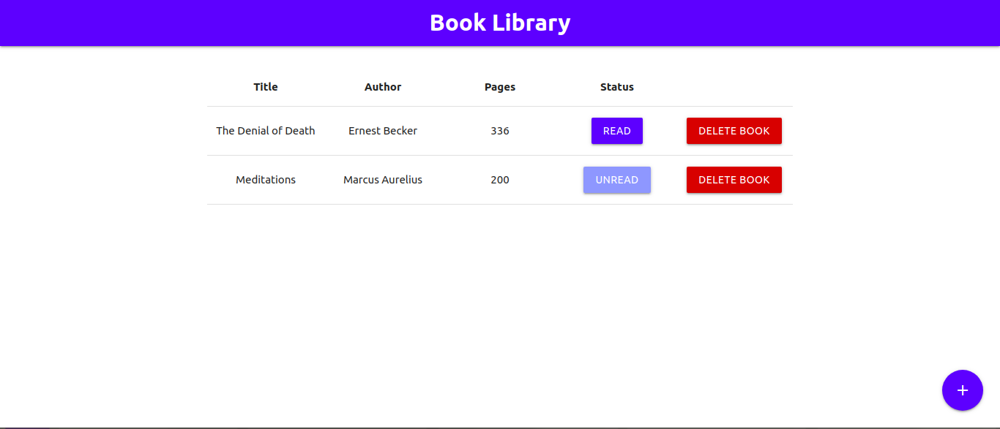

<h1 align="center">Book Library</h1>
<p>
  
  <a href="https://github.com/ebukaume/book-library#readme" target="_blank">
    
  </a>
  <a href="https://github.com/ebukaume/book-library/graphs/commit-activity" target="_blank">
    
  </a>
  <a href="https://github.com/ebukaume/book-library/blob/master/LICENSE" target="_blank">
    
  </a>
  <a href="https://twitter.com/ebukaume" target="_blank">
    
  </a>
</p>

<br>

<p>
  <a href="https://nazeh.github.io/book-library/" target="_blank">
    
  </a>
</p>

<br>

This project is part of a series of projects to be completed by students of [Microverse](https://www.microverse.org/ "The Global School for Remote Software Developers!").

Book Library is a collaborative project by [Ar Nazeh](https://github.com/Nazeh) and [Ebuka Umeokonkwo](https://github.com/ebukaume). The full project description can be found [here](https://www.theodinproject.com/courses/javascript/lessons/library).

## Built With

- JavaScript
- HMTL/SCSS
- Materialize

## Usage

The live version of the webapp can be found [here](https://raw.githack.com/Nazeh/book-library/master/index.html)

> Clone the repository to your local machine

```sh
$ git clone https://github.com/Nazeh/book-library.git
```

> cd into the directory

```sh
$ cd book-library
```

> Open `index.html` using your favourite broswer: 

## Contributing

1. Fork it (https://github.com/Nazeh/book-library/fork)
2. Create your feature branch (git checkout -b feature/[choose-a-name])
3. Commit your changes (git commit -am 'what this commit will fix/add')
4. Push to the branch (git push origin feature/[chosen-name])
5. Create a new Pull Request

## License

This project is licensed under the MIT License - see the [LICENSE](./LICENSE) file for details

## Contact me

I am looking for my next opportunity. Reach out to me if you are looking to hire!
_ebukaume@gmail.com_
